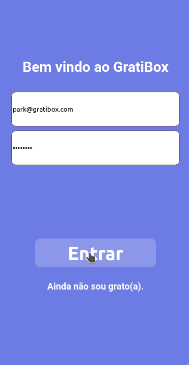

# Gratibox



Try it out now at [http://front-gratibox.vercel.app/](http://front-gratibox.vercel.app/)

## About

GratiBox is a service that delivers you boxes of meditation goodies.

Features include:

- Register
- Login
- See available plans in a selection
- Subscribe to a plan
- See your active plan

## Technologies

- React
- React Router Dom
- Axios
- styled-components

## Running locally

1. Clone the front-end repo

```sh
git clone https://github.com/Deltinha/front-gratibox.git
```

2. Install NPM packages for the front-end repo

```sh
npm install
```

3. Run the app in development mode

```sh
npm start
```

Open [http://localhost:3000](http://localhost:3000) to view it in the browser.

### You also need to run the back-end repo.

See [https://github.com/Deltinha/back-gratibox](https://github.com/Deltinha/back-gratibox) for details.
